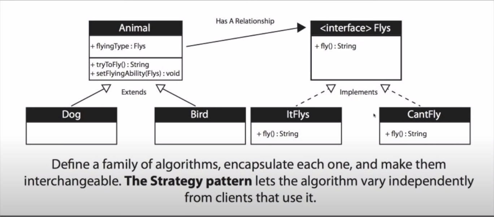

# Problem
I have Animal super class, dog & bird subclass. Now i would like to give power to fly to my subclass

## Bad code

- create a fly method in animal and automatically inherit it. it is bad because now Dog can fly

- create a fly method inside bird, but eventually we will end up duplicate code when some other animal like flying dinosour need to fly.

- create an interface which force the creation of a method in subclass. like
 
 ```javascript
public interface Flys {
  void fly()
}

public class Bird extends Animal implements Flys
```

 this will lead to lots of duplicate code 

## Good Code

- We should create a interface of this behavior, different class will implement this behavior and we will use this interface as an instance variable of Animal(super class) and then create a method to fly and through polymorphism each subclass will fly according to their algorithm. now any subclass can use any implementation they want.

### advantages: 

- we should think this behavior as an algorithm which might have different variation down the line. for example: some bird fly high, some fly low.... 

- Decoupling, abstracting out what varies.

- this is also known as composition, instead of inheriting one behavior from parent, sub classes are composed of right behavior they need.

- due to composition now we can change the behavior of class on run time. for example our bird broke its wings, now it can't fly.

- We should create a interface of this behavior, different class will implement this behavior and we will use this interface as an instance variable of Animal(super class) and then create a method to fly and through polymorphism each subclass will fly according to their algorithm. now any subclass can use any implementation they want.

### UML

